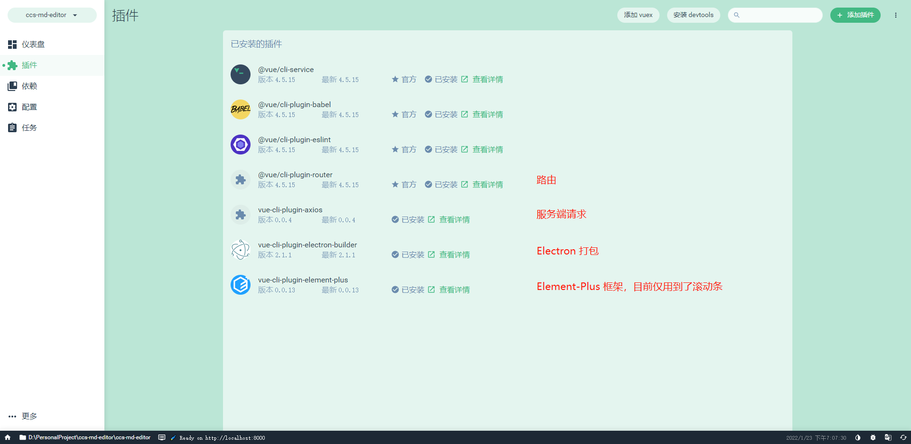
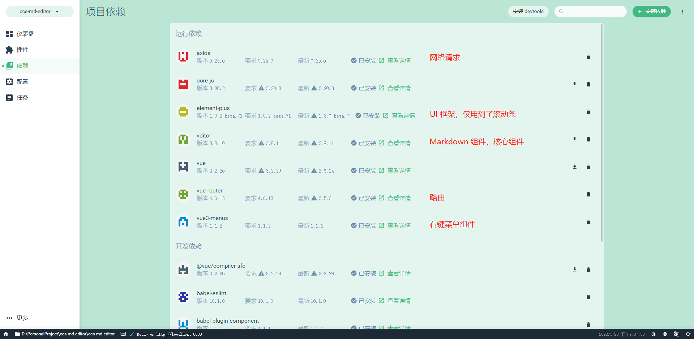
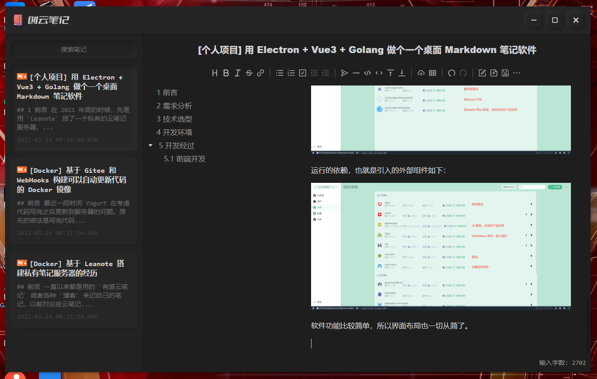
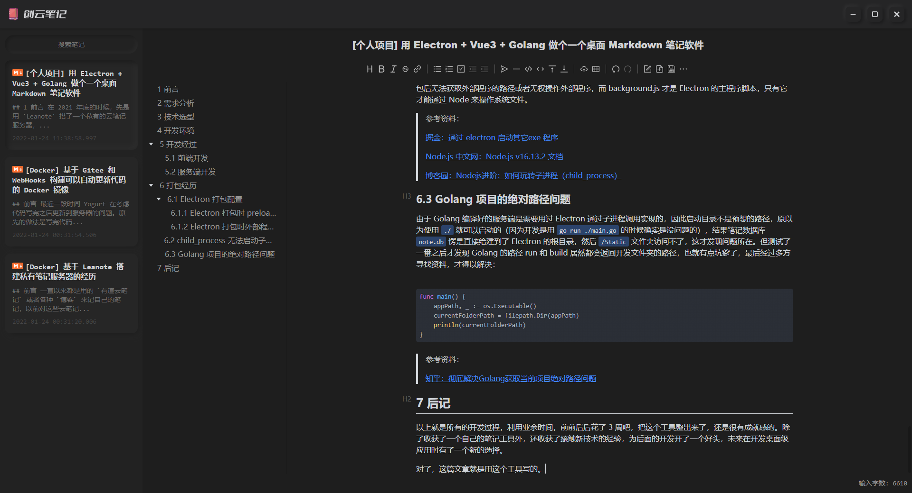

## 1 前言

在 2021 年底的时候，先是用 `Leanote` 搭了一个私有的云笔记服务器，后面嫌弃功能不够强大，页面不够好看，基于 `Vditor` 组件又给自己做了一个云服务器版的笔记软件。但是吧，`Vditor` 功能很全面，但就是包有点太大了，网络不好的时候还打不开，着急要看笔记的时候有点尴尬。还有一个问题是，云服务器当时买回来就是拿来做测试的，说不准哪天就重装了，没打算长时间存储数据，还会面临忘记续费的尴尬，再说了，目前技术能力和时间精力也比较有限，服务器的安全性也是个头疼的问题。思来想去，感觉借着上次的经验，可以搞一个本地的笔记软件。

## 2 需求分析

作为一个自用标准的笔记软件，目前的需求如下：

- 😆 界面好看，暗黑色系。日常使用的软件基本都是暗黑的，夜间场景比较多，各种切换不要受到影响
- 😛 交互越少越好，专注与笔记本身。什么登录啊、弹窗啊、广告啊什么的，统统不要，能 CURD 就行。
- 🙄 支持全局搜索，一个文件管理所有的笔记
- 🥰 Markdown 编辑所见即所得，像 Typora 一样

## 3 技术选型

根据需求，结合自己目前所了解的技术能力，做如下选型：

- **核心组件**：作为一个 Markdown 笔记，最重要的就是渲染器了，`Vditor` 是目前自己能找到的最好的一款 Markdown 组件了。再说了，上次在开发云服务器版的时候也有了一定的经验（~~有老代码可以抄🤡~~）因此所有辅助类型的技术选型都将围绕于此。
- **桌面部分**：既然核心组件已经是一个 Web 前端项目了，那么作为载体，必然就是一个浏览器了，这里一开始有两个方案可以选择。一是使用 C# 开发，在 Winform 中嵌入 Chromium 浏览器部件 ——Cefsharp。这也算是比较有经验的操作，毕竟利用这个部件开发过一个爬虫工具。之所以最终没有选用，则是因为界面设计上没法达到个人的审美要求，以及在使用 WPF开发时，嵌入 Chromium 后输入法的焦点无法定格在主界面，因此该方法直接流产了。第二个方案则是当前成品的方案了，使用 `Electron` 框架来开发。显而易见，效果很好。Vditor 支持 Vue3，所以桌面部分就用 Electron + Vue3 来开发即可。
- **服务端**：就目前 Yogurt 对 Node.js 的技术理解程度而言，Electron 仅仅能帮忙解决前端效果呈现的问题，而操作数据存储和图片存储等相关的问题上暂时没有办法通过 Node.js 来解决，此时就需要考虑使用别的手段。目前有三个方案：Python、C# 和根本就不太熟的 Golang。三者的优劣也比较清晰，Python 是目前个人的主力语言，熟悉且开发速度快，各种各样的包也比较多。C# 也比较熟悉，关键是最倾向的一个轻量级 NoSQL 数据库 —— liteDB 仅支持 .NET 环境。Golang 就非常不熟悉了，才接触了不到 2 个月，处于一个边写边忘的阶段。最终考虑到桌面应用运行环境安装和维护的便捷性，以及本次服务端的开发重点，抱着学习的心态，最后选择了 `Golang` 作为服务端的开发语言。
- **数据库**：开发的侧重点是桌面级应用，因此对数据存储的首要要求就是轻量，其他部分只要满足正常的 CURD 就足够了，一个人写个笔记，也没啥性能瓶颈。个人理想中是想选择一个轻量级的单文件 NoSQL 数据库的，后面找了半天没找到合适的，最后还是回到了经典数据库的怀抱 —— `Sqlite3`。

## 4 开发环境

| 信息          | 说明                                            |
| --------------- | ------------------------------------------------- |
| 操作系统      | Microsoft Windows 10 专业工作站 10.0.19042 64位 |
| 开发工具      | Visual Studio Code                              |
| Vditor 版本   | 3.8.10                                          |
| Electron 版本 | 13.0.0                                          |
| Vue 版本      | 3.0.0                                           |
| Node 版本     | 16.13.1                                         |
| NPM 版本      | 8.1.2                                           |
| Golang 版本   | go version go1.17.5 windows/amd64               |
| Sqlite3 版本  | 3.32.3                                          |

## 5 开发经过

### 5.1 前端开发

一开始是打算将 `Vue` 和 `Electron` 分开，先把 `Vue` 的部分完成，再用 `Electron` 打包，奈何自己对 `Electron` 实在是不够熟悉，索性就算了。后面发现 Vue 支持 Electron，然后就用

```powershell
vue ui
```

命令来创建 Vue 项目了。已安装的插件如下：



运行的依赖，也就是引入的外部组件如下：



软件功能比较简单，所以界面布局也一切从简了。



以上就是所有的布局了：

* 💡 上方负责标题栏和窗体控制
* 💡 左侧负责笔记导航
* 💡 右侧最大的区域负责笔记的编辑

界面 UI 上尝试了最近关注度比较高的 `新拟态` 效果，由于界面设计比较简单，总体来说效果还是不错的。~~由于是自己开发的，后期如果有什么新效果，也可以尝试往里面放，嗯，可以折腾一下🤩~~。

具体代码，详见 gitee 仓库 [https://gitee.com/Yogurt_cry/ccs-md-editor](https://gitee.com/Yogurt_cry/ccs-md-editor)

### 5.2 服务端开发

加上上次做云服务器版的开发，这次算是第二次用 `Golang` 开发项目了。项目比较简单，再加上是单机版的，笔记的 CURD 才是关键点，因此代码合计下来也不过才 290 行。主要是实现了：`检索` 、`新建` 、`保存` 、`删除` 、`获取`，也就是 CURD。

所以使用 Golang 来操作 sqlite3 就是关键，不知道该怎么处理，所以就参考了一下网上大神的操作，完成了开发。

> 参考资料：
> 
> [知乎：golang操作sqlite3](https://zhuanlan.zhihu.com/p/393760841)

## 6 打包经历

相比于打包来说，开发上面其实没有花多长时间，前端开发最花时间的就是 `新拟态` 的阴影，调试了很久才出来自己比较满意的效果。

对于桌面开发习惯了 `Visual Studio` 的 `F5` 运行测试，`F6` 编译解决方案的我来说，打个包还会出各种各样幺蛾子的 `Electron` 着实是有点不习惯。

原以为只要一个：

```powershell
npm run electron:build
```

就可以解决所有问题，结果花了我 5 个多小时去处理各种各样的异常错误。

### 6.1 Electron 打包配置

这是第一个没想到的问题，第一次打包完后启动不了，嗯。。。准确的说应该是启动了，但是没法进入项目，就一个黑屏。跟 Vue 打包完后没有通过 Nginx 配置的效果一样。

最终通过多方寻找资料，才知道用 `vue-cli-plugin-electron-builder` 原来是需要写配置文件的。。。还以为全都搞好了。

> 参考资料：
> 
> [简书：在vue-cli-plugin-electron-builder下用electron:build打包或生成应用程序的两种方法](https://www.jianshu.com/p/1dbb96bc8f37)
> 
> [简书：electron-builder打包指定资源到安装目录](https://www.jianshu.com/p/9fc6ae1a7317)
> 
> [CSDN：electron如何使用webpack打包webview标签中的preload文件](https://blog.csdn.net/SDFGS54DGF5S4/article/details/112914379)
> 
> [Vue Cli：Vue Cli 插件 Electron Builder](https://nklayman.github.io/vue-cli-plugin-electron-builder/guide/configuration.html#table-of-contents)
> 
> [electron-builder：Any Windows Target](https://www.electron.build/configuration/win)

#### 6.1.1 Electron 打包时 preload.js 没有输出的问题

嗯，这也是打包配置文件的问题。

#### 6.1.2 Electron 打包时外部程序没有输出的问题

嗯，这也是打包配置文件的问题。

打包参考示例如下：

```js
module.exports = {
  pluginOptions: {
    electronBuilder: {
      builderOptions: {
        appId: 'com.ccsdesgin.note',
        productName: '创云笔记',
        copyright: 'Copyright © 2022',
        directories: {
          output: './dist_electron'
        },
        extraResources: {
          from: './server',
          to: 'server'
        },
        win: {
          icon: './public/favicon.ico',
          target: [
            {
              target: 'nsis',
              arch: [ 'x64' ]
            }
          ]
        },
        nsis: {
          oneClick: false,
          allowElevation: true,
          allowToChangeInstallationDirectory: true
        }
      },
      preload: './src/preload.js'
    }
  }
}
```

### 6.2 child_process 无法启动子进程的问题

一开始 Yogurt 是放在 `main.js` 里的，就是 Vue 项目的 main.js 里。就一直在报找不到文件。后面也是因为解决了外部文件引入的问题，才真正得以解决。


需求是在主窗体启动之前需要启动后台服务，一直以为应该是放在 main.js 里，结果操作了好几次都无法成功，后面想想要不就放在 `background.js` 里试试，然后就可以了。估计是 main.js 是 Vue 项目里的主程序脚本，打包后无法获取外部程序的路径或者无权操作外部程序，而 background.js 才是 Electron 的主程序脚本，只有它才能通过 Node 来操作系统文件。

> 参考资料：
> 
> [掘金：通过 electron 启动其它exe 程序](https://juejin.cn/post/6845166890248044557)
> 
> [Node.js 中文网：Node.js v16.13.2 文档](http://nodejs.cn/api/child_process.html)
> 
> [博客园：Nodejs进阶：如何玩转子进程（child_process）](https://www.cnblogs.com/chyingp/p/node-learning-guide-child_process.html)

### 6.3 Golang 项目的绝对路径问题

由于 Golang 编译好的服务端是需要用过 Electron 通过子进程调用实现的，因此启动目录不是预想的路径，原以为使用 `./` 就可以启动的（因为开发是用 `go run ./main.go` 的时候确实是没问题的），结果笔记数据库 `note.db` 愣是直接给建到了 Electron 的根目录，然后 `/Static` 文件夹访问不了，这才发现问题所在。但测试了一番之后才发现 Golang 的路径 run 和 build 居然都会返回开发文件夹的路径，也就有点坑爹了，最后经过多方寻找资料，才得以解决：

```go
func main() {
    appPath, _ := os.Executable()
    currentFolderPath = filepath.Dir(appPath)
    println(currentFolderPath)
}
```

> 参考资料：
> 
> [知乎：彻底解决Golang获取当前项目绝对路径问题](https://zhuanlan.zhihu.com/p/363714760)

## 7 后记

以上就是所有的开发过程，利用业余时间，前前后后花了 3 周吧，把这个工具整出来了，还是很有成就感的。除了收获了一个自己的笔记工具外，还收获了接触新技术的经验，为后面的开发开了一个好头，未来在开发桌面级应用时有了一个新的选择。

对了，这篇文章就是用这个工具写的。


